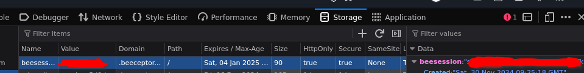

1. Get your beeceptor session. Look for the cookie value inside the developer tools and triple click copy it.



2. Set the environment variable `BEECEPTOR_SESSION` with the cookie value.

```bash
export BEECEPTOR_SESSION="cookie_value" # bash
set -x BEECEPTOR_SESSION <cookie_value> # fish
```
